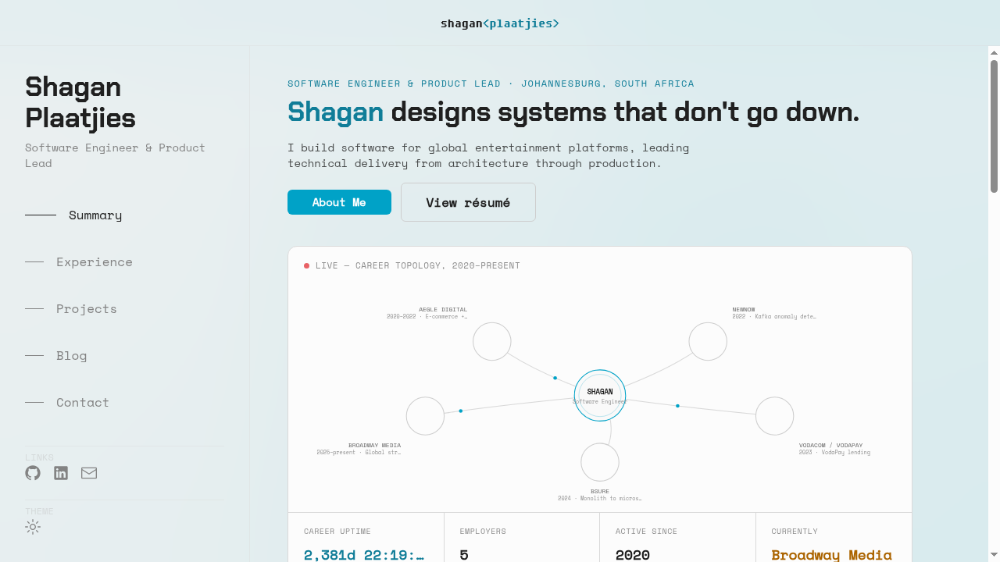
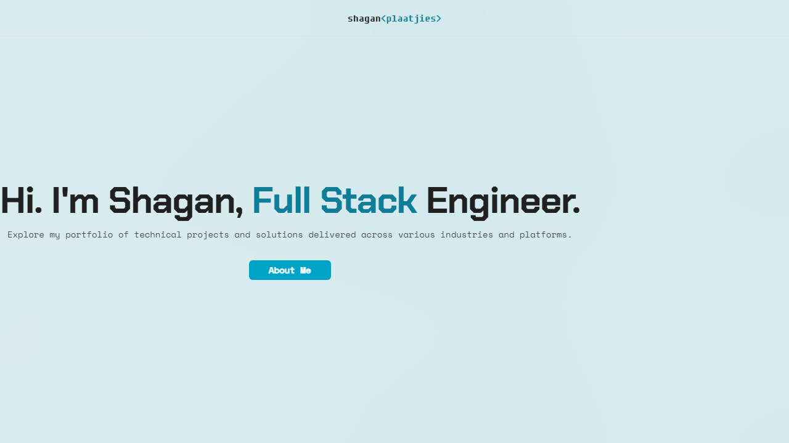

# Shagan Plaatjies

[View Live](https://shaganplaatjies.co.za)

## About

This is the source for my personal portfolio site.
It is a Next.js 15 App Router application with a custom Express server, styled as a "desktop OS" experience: content is presented as draggable window cards on a desktop-style canvas rather than a conventional scrolling page.

### Features

- **Live System hero** - the homepage and the `/experience`/`/projects` pages open with an animated SVG career-topology dashboard: real work-history data (fetched from WordPress, with a static fallback) rendered as nodes orbiting a center node, plus a stat strip of career-uptime and employer metrics.
- **Desktop OS themed UI** - sections are rendered as window cards (with window chrome and controls) on a desktop-style canvas, animated with Framer Motion and GSAP.
- **Blog** - posts are authored in WordPress and pulled in as a headless CMS, then rendered as native Next.js pages at `/blog`.
- **Projects** - a project showcase at `/projects`, with individual project detail pages.
- **Experience timeline** - a work history / experience section at `/experience`.
- **Live-coded music** - a Strudel-powered music section on the homepage that plays a live-coded pattern (`app/lib/strudel/first-song.str`) through the Web Audio API, muted by default with a play/stop control.
- **Contact form** - a contact form backed by a Next.js API route (`app/api/contact`) that sends email via Resend.
- **SEO/discovery metadata** - Open Graph and Twitter card metadata (including generated OG images and a favicon via `app/opengraph-image.tsx` and `app/icon.tsx`), a dynamic `sitemap.xml`, `robots.txt`, and a web app manifest.

## Tech stack

| Layer | Technology |
| --- | --- |
| Framework | [Next.js 15](https://nextjs.org/) (App Router) |
| Server | Custom [Express](https://expressjs.com/) server (`server.js`) |
| Styling | [Tailwind CSS](https://tailwindcss.com/) |
| UI primitives | [Radix UI](https://www.radix-ui.com/) |
| Animation | [Framer Motion](https://www.framer.com/motion/) and [GSAP](https://gsap.com/) |
| Music | [Strudel](https://strudel.cc/) (`@strudel/core`, `@strudel/mini`, `@strudel/transpiler`, `@strudel/webaudio`) for live-coded pattern playback via the Web Audio API |
| Email | [Resend](https://resend.com/) (contact form + React Email templates) |
| Content | [WordPress](https://wordpress.org/) as a headless CMS for blog posts |

## Local development

Install dependencies:

```bash
npm install
```

Start the dev server:

```bash
npm run dev
```

`dev` runs `next dev --experimental-https`.
The `--experimental-https` flag serves the local dev build over HTTPS (with a self-signed certificate) because `server.js` wraps the Next.js request handler in a local HTTPS server outside of production.

You will need a set of environment variables for things like the WordPress domain, Resend API key, contact form recipient, SSL cert paths, and the app port.
These are documented in `.env.example`.

## Scripts

| Script | Command | Description |
| --- | --- | --- |
| `npm run dev` | `next dev --experimental-https` | Runs the Next.js dev server locally over HTTPS with hot reload. |
| `npm run build` | `next build` | Produces an optimized production build. |
| `npm run start` | `node server.js` | Serves the production build through the custom Express server. |
| `npm run lint` | `next lint` | Lints the codebase with ESLint (`next/core-web-vitals`, `plugin:jsx-a11y/recommended`). |
| `npm run verify` | `tsc --noEmit && next lint` | Type-checks the project, then lints it. Useful as a single pre-commit / CI sanity check. |
| `npm run test:e2e` | `playwright test` | Runs the Playwright end-to-end suite against a production build (see Testing below). |

## Testing

End-to-end tests live under `e2e/` and run with [Playwright](https://playwright.dev/).
`npm run test:e2e` builds the app and serves it through `server.js` (the same production entrypoint used in deployment).
The suite is wired up as a manually-triggered GitHub Actions workflow (`.github/workflows/e2e.yml`) rather than a PR gate, since the smoke tests hit the real, live WordPress backend.

## Screenshots

### Home



The home page renders as a desktop-style window with a sidebar navigation menu, matching the "desktop OS" theme described above, opening with the Live System hero's career-topology dashboard.
The topology shown above was captured in a sandboxed environment without network access to the WordPress instance, so it falls back to a static seed of real employers rather than live WordPress-sourced data.

### Projects



The projects list is populated from WordPress at build/request time.
The screenshot above was captured in a sandboxed environment without network access to the WordPress instance, so it only shows the static landing header; with WordPress reachable, this page also renders a card per project.
